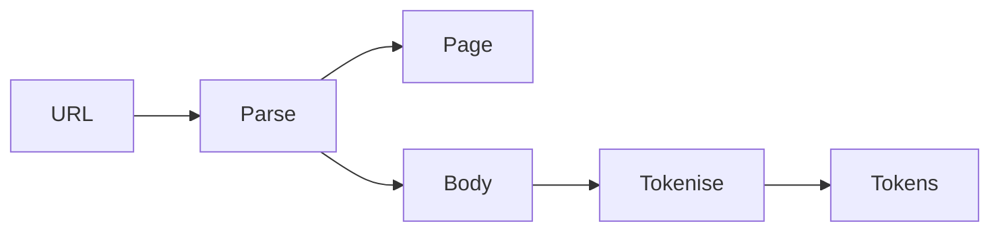

<h1 align="center">parser</h1>

tiny go library that fetches a webpage and pulls out the title, meta
description, links, and body text. also tokenises text into words.



- normalises urls
- strips scripts and styles
- filters out mailto/tel/etc links
- only keeps words longer than 2 chars when tokenising

## install

```
go get github.com/ufraaan/parser
```

## usage

```go
import "github.com/ufraaan/parser"

page, body, _ := parser.Parse("https://example.com")
tokens, _ := parser.Tokenise(body)
```

<p align="center">uses <a href="https://github.com/PuerkitoBio/goquery">goquery</a></p>
